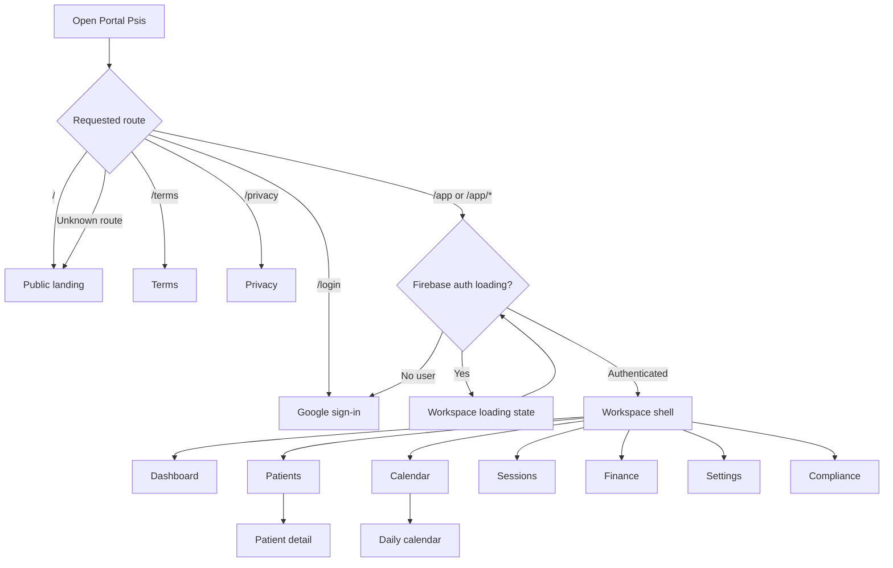
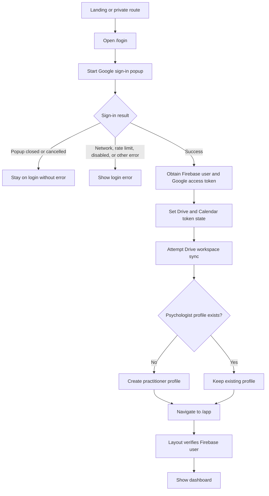
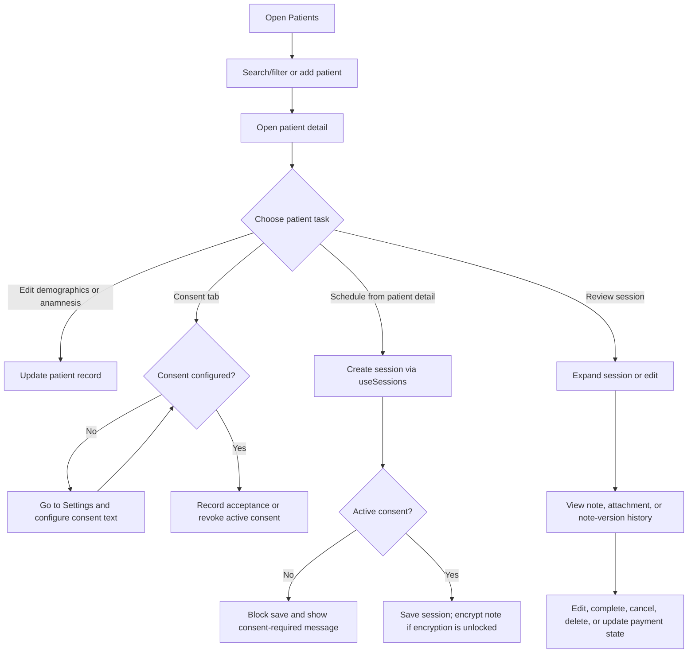
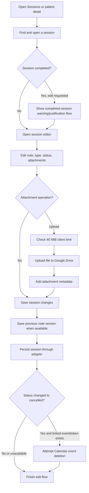
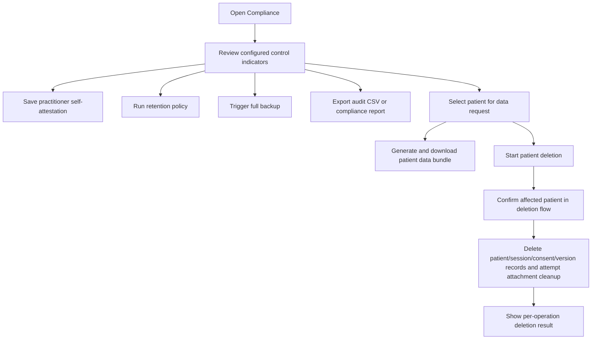
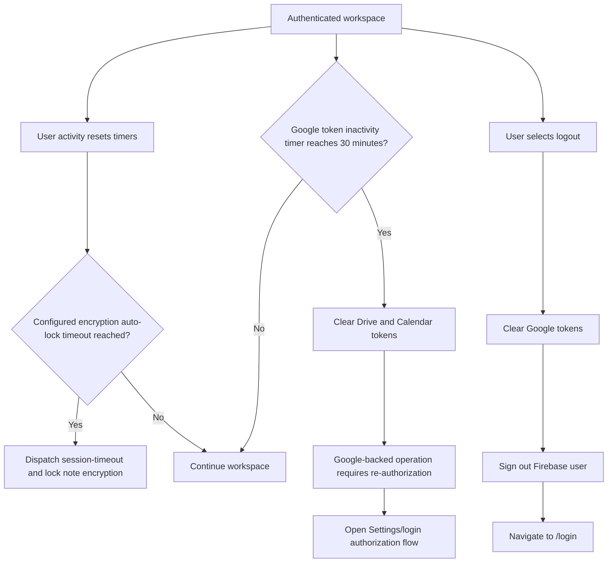

# Portal Psis App Flow

**Status:** Current beta application flow
**Last updated:** 2026-09-25

This document maps the current browser routes and user journeys implemented in Portal Psis. It describes observed behavior, including known differences between entry points; it is not a target-state specification.

## 1. Application Entry and Navigation

All routes use `HashRouter`. The private route tree is nested under `/app` and rendered through `Layout`. `Layout` checks Firebase auth state: while it is loading, it shows a loader; without a user, it redirects to `/login`; with a user, it renders the sidebar, workspace header, alerts, and the selected child route.

The cookie-consent banner and session-timeout toast are mounted at the application level. The sidebar provides navigation, language switching between Portuguese and English, and logout. The patient and calendar navigation items have sub-actions for adding/showing patients and switching calendar views.

## 2. Sign-In and Workspace Initialization

The Google OAuth request asks for identity, Calendar event, Drive app-data, and Drive file scopes. Firebase identity and Google API authorization are separate: the workspace can be authenticated while Drive or Calendar access is unavailable. Google tokens are held in memory and must be obtained again after reload if absent.

When a Google API call returns 401 or 403, the workspace shell clears Google tokens and signs out the Firebase user in the current `Layout` handler. Other surfaced Google auth errors can appear as an authorization alert with a Settings route. Actual behavior depends on which integration emitted the event.

## 3. Main Workspace Navigation

| Destination | Main entry point | Common next actions |
| --- | --- | --- |
| Dashboard (`/app`) | Workspace default | Review today's sessions, recent activity, and practice summary; navigate to patient or calendar tasks |
| Patients (`/app/patients`) | Sidebar or patient shortcut | Search/filter, add patient, open patient detail |
| Patient detail (`/app/patients/:id`) | Patient list | Edit patient, review consent, create or update sessions, inspect note history, request deletion |
| Calendar (`/app/calendar`) | Sidebar | Browse month/week/day schedule, create a session, open daily schedule |
| Daily calendar (`/app/calendar/daily`) | Calendar sub-navigation | Inspect daily schedule and weekly session overview |
| Sessions (`/app/sessions`) | Sidebar | Search session history, edit details/notes, manage attachments, change status |
| Finance (`/app/finance`) | Sidebar | Review period summaries and patient payment state; mark payments paid/pending |
| Settings (`/app/settings`) | Sidebar or auth recovery link | Edit practitioner profile, configure consent/retention, re-authorize services, export CSV, configure encryption |
| Compliance (`/app/compliance`) | Sidebar or retention reminder | Review status/self-attestation, run retention, create backup, export data/audit records, delete patient data |

On mobile, the sidebar is a drawer that closes after navigation. Language switching is available from the sidebar. Logout clears Google tokens, signs out, and routes to `/login`.

## 4. Patient and Session Workflow

### Session creation entry points

- **From patient detail:** `useSessions.addSession` checks for active patient consent. If consent is missing or revoked, save is rejected with a consent-required message. When an encryption key is unlocked, session notes are encrypted before they are stored.
- **From calendar's new-session modal:** the modal writes session records through the Firestore-shaped adapter directly. It can create recurring session records and optionally creates a Google Calendar event for the first instance of each selected slot. This route currently does not call the patient-detail consent gate or the encryption hook. This is a known behavior inconsistency and should be resolved before treating consent and encryption behavior as uniform across all session entry points.

The exact Calendar event behavior varies by operation. The modal attempts event creation and stores the returned event ID on the session. Session edit/cancel flows attempt to update or delete linked events when tokens are available; these are separate remote operations from workspace persistence.

## 5. Session Documentation Workflow

Notes use Markdown editing and sanitized Markdown rendering. Previous note content can be stored in note-version records when an existing note is overwritten. Draft edit forms in the Sessions page use localStorage keys named `draft_edit_<sessionId>`; these drafts are separate from the workspace persistence mechanism.

## 6. Privacy and Compliance Workflows

The compliance status panel reflects a combination of local configuration checks and user self-attestation; a passing panel is not an external compliance certification. Backup snapshots and deletion are separate workflows: patient deletion attempts to remove current records and associated attachments, but historical backup snapshots are not removed by the deletion function.

## 7. Session Timeout, Re-Authorization, and Logout

The Google token timer clears Google API tokens after 30 minutes without observed pointer, keyboard, click, or scroll activity in `GoogleAuthContext`. A separate workspace inactivity timer can lock note encryption when an auto-lock duration is configured on the practitioner profile. Firebase sign-in and encryption-key state have separate lifecycle behavior; they should not be represented as one shared timeout.

## 8. Route and Error Behavior

- Unknown paths redirect to the public landing page.
- Private workspace routes wait for Firebase auth state, redirect unauthenticated users to login, and otherwise render the requested page within the workspace shell.
- Lazy-loaded workspace pages use a route-level loading fallback.
- An application error boundary wraps route rendering.
- Google API authorization failures may clear tokens/sign out or show an alert, depending on event handling and status.
- Drive persistence errors are not uniformly represented as a user-visible sync state in the current adapter; an operation may complete in memory while remote synchronization fails.
- Session creation/editing from different routes currently follows different consent and encryption paths, as described in Section 4.

## 9. Known Flow Gaps

1. **Session consent enforcement:** patient-detail session creation checks active consent, while the calendar modal writes directly. Consolidate session creation behind one domain-level workflow and test each entry point.
2. **Encryption consistency:** patient-detail creation encrypts notes only when the key is unlocked; the calendar modal bypasses this path. Ensure all session write paths share the same encryption policy.
3. **Data reload continuity:** the current Drive workspace loader restores fewer collections than the app uses. Consent and note-version flows may not survive reload consistently until the persisted collection contract is fixed.
4. **Sync outcome visibility:** the adapter can catch Drive failures without a durable per-write sync status. The UI should distinguish saved-in-memory, pending, and remotely confirmed states.
5. **Deletion scope:** the current patient deletion flow does not remove backup snapshots, and some sub-operation errors are logged rather than returned as complete per-resource results.
6. **Authorization recovery:** a 401/403 handler currently signs out the Firebase user as well as clearing Google tokens; this is broader than simply re-authorizing the affected Google service.

## 10. Source Map

- Route tree and global providers: [src/App.tsx](src/App.tsx)
- Auth gate, alerts, and timeout setup: [src/components/Layout.tsx](src/components/Layout.tsx)
- Sidebar destinations and actions: [src/components/Sidebar.tsx](src/components/Sidebar.tsx)
- Google sign-in and requested scopes: [src/pages/Login.tsx](src/pages/Login.tsx)
- Patient detail workflow: [src/pages/PatientDetail.tsx](src/pages/PatientDetail.tsx)
- Session creation and Calendar event flow: [src/components/NewSessionModal.tsx](src/components/NewSessionModal.tsx)
- Session history and editing: [src/pages/Sessions.tsx](src/pages/Sessions.tsx)
- Consent state and actions: [src/hooks/usePatientConsent.ts](src/hooks/usePatientConsent.ts)
- Session consent/encryption path: [src/hooks/useSessions.ts](src/hooks/useSessions.ts)
- Compliance data tasks: [src/pages/Compliance.tsx](src/pages/Compliance.tsx)
- Google token lifecycle: [src/context/GoogleAuthContext.tsx](src/context/GoogleAuthContext.tsx)
- Persistence and Drive adapter: [src/lib/firestore-mock.ts](src/lib/firestore-mock.ts)