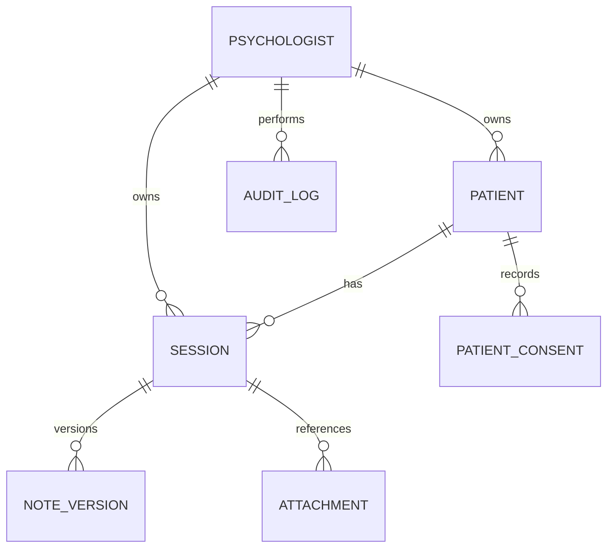

# Portal Psis Backend Data Schema

**Status:** Existing logical model and canonical schema proposal
**Last updated:** 2026-09-25

Related documents: [PRD](PRD.md), [TRD](TRD.md), [App Flow](APP_FLOW.md).

## 1. Purpose

This document records the data shapes used by the application and proposes a canonical, versioned schema for persistence. The current application exposes Firestore-shaped functions, but Vite aliases `firebase/firestore` to a custom adapter that stores a whole workspace in Google Drive JSON. The tables below therefore describe logical collections, not proof that these records currently live in Firebase Firestore.

Use `src/types.ts` and feature-specific interfaces as implementation evidence. Where types, Firestore rules, and runtime code disagree, the mismatch is called out rather than silently normalized.

## 2. Current Persistence Model

The current adapter maintains arrays for `patients`, `sessions`, `psychologists`, `audit_logs`, `patient_consents`, and `note_versions`. The normal Drive workspace loader reconstructs only `patients`, `sessions`, `psychologists`, and `audit_logs`; this means consent and note-version data may not round-trip after reload. The backup builder includes consents but does not include note-version records or attachment binaries.

The adapter saves a serialized workspace to `workspace.json` in Google Drive `appDataFolder`. It uses an in-memory state model and a debounced whole-file write. localStorage support is a legacy fallback/cleanup path, not a reliable durable offline database.

## 3. Canonical Collection Model

Recommended common fields for practitioner-owned records:

| Field | Type | Requirement | Description |
| --- | --- | --- | --- |
| `id` | string | Required | Stable record identifier; in Firestore, preferably also the document ID |
| `psychologistId` | string | Required for owned records | Firebase Auth UID of the owning practitioner |
| `createdAt` | ISO-8601 UTC string or backend timestamp | Required on create | Record creation time; choose one canonical representation per backend |
| `updatedAt` | ISO-8601 UTC string or backend timestamp | Required for mutable records | Last successful update time |
| `schemaVersion` | integer | Required in workspace envelope; optional per document | Enables controlled migrations |

Do not store the same identifier inconsistently as both document ID and mutable payload ID. If payload `id` remains for export compatibility, validate it against the document ID.

### 3.1 `psychologists/{psychologistId}`

One practitioner profile per Firebase UID.

| Field | Type | Notes |
| --- | --- | --- |
| `id` | string | Should equal document ID/UID |
| `name` | string | Required display name |
| `email` | string | Provider-derived identity; do not allow arbitrary ownership reassignment |
| `specialization` | string[] | Optional profile data |
| `bio` | string | Optional profile data |
| `avatarUrl` | string | Optional provider/profile image URL |
| `consentText` | string | Configured patient consent text |
| `consentVersion` | string | Version of the consent template |
| `retentionPolicy` | string | Optional practitioner-authored policy description |
| `retentionYears` | number | Positive configured retention period |
| `retentionEnabled` | boolean | Whether automatic retention is enabled |
| `lastRetentionRun` | ISO-8601 string | Last attempted/completed run timestamp; semantics should be explicit |
| `crpNumber`, `crpRegion` | string | Practitioner-provided registration details |
| `attestation` | object | Self-attestation fields and `updatedAt` |
| `dpoName`, `dpoEmail` | string | Optional practitioner-configured contact |
| `autoLockMinutes` | number | Optional encryption auto-lock setting read by workspace shell |

The profile creation path currently writes `id`, `name`, `email`, `specialization`, `bio`, `avatarUrl`, and `createdAt`; later settings may add other optional fields.

### 3.2 `patients/{patientId}`

| Field | Type | Requirement/notes |
| --- | --- | --- |
| `id` | string | Stable patient ID |
| `psychologistId` | string | Required owner UID |
| `name` | string | Required |
| `email`, `phone` | string | Contact details; optionality should be formalized |
| `cpf` | string | Optional sensitive identifier; minimize collection and exposure |
| `dateOfBirth` | ISO-8601 date string | Use date-only semantics; do not apply timezone conversion |
| `gender` | string | Optional demographic value; define allowed values and free-text policy |
| `address` | object | `country`, `zipCode`, `city`, `state`, `street`, `number`, optional `complement`, `neighborhood` |
| `education`, `ethnicity` | string | Optional demographic fields; access and purpose should be documented |
| `financialPlan` | enum/string | Current UI values include per-session, monthly, health insurance, exempt; canonical enum needed |
| `financialValue` | decimal-safe string or integer minor units | Current model uses string; define currency and parse/rounding rules before financial calculations |
| `anamnesis` | object | Structured clinical intake described below |
| `notes` | string or encrypted payload string | Optional; current hook encrypts this field only when encryption is unlocked |
| `createdAt`, `updatedAt` | timestamp | Required |

Current anamnesis fields:

| Field | Type | Encryption behavior |
| --- | --- | --- |
| `chiefComplaint` | string | Encrypted when encryption is unlocked |
| `medicalHistory` | string | Encrypted when encryption is unlocked |
| `psychiatricHistory` | string | Encrypted when encryption is unlocked |
| `familyHistory` | string | Encrypted when encryption is unlocked |
| `medications` | string | Encrypted when encryption is unlocked |
| `substanceUse` | string | Encrypted when encryption is unlocked |
| `familyStructure` | string | Encrypted when encryption is unlocked |
| `workStudies` | string | Encrypted when encryption is unlocked |
| `socialHabits` | string | Encrypted when encryption is unlocked |
| `psychiatricHistoryDetailed` | string | Encrypted when encryption is unlocked |
| `recurrentSymptoms` | string | Encrypted when encryption is unlocked |
| `predominantEmotions` | string | Encrypted when encryption is unlocked |

Encryption is opt-in in the current UI. Unlocked state enables encryption; locked/unconfigured state can leave these values as plaintext. Patient name, contact details, demographics, financial fields, and other record metadata are not covered by the current field-level note encryption.

### 3.3 `sessions/{sessionId}`

| Field | Type | Requirement/notes |
| --- | --- | --- |
| `id` | string | Stable session ID |
| `patientId` | string | Required reference to patient |
| `psychologistId` | string | Required owner UID |
| `date` | ISO-8601 datetime string | Current UI writes strings; Firestore rules currently require timestamp. Standardize before switching runtime backend. |
| `duration` | integer minutes | Required; default behavior currently assumes 60 minutes for Calendar event endpoints |
| `type` | enum | `individual`, `group`, `family`, `couple` |
| `status` | enum | App uses `scheduled`, `completed`, `cancelled`, `no-show`; rules use `no_show`. Normalize serialization. |
| `notes` | string | Markdown plaintext or JSON-stringified encrypted payload `{version, ciphertext, iv}` |
| `attachments` | object[] | `name`, `url`, `size`, optional `storagePath`; URLs/object URLs should not be treated as durable file identity |
| `googleEventId` | string | Optional linked Calendar event identifier |
| `paymentStatus` | enum | Canonical values should be `pending` or `paid`; current TypeScript type is unconstrained string |
| `financialAmountMinor` | integer | Recommended snapshot of amount charged for the session; not currently modeled, needed for stable historical finance reporting |
| `recurrenceGroup` | string | Optional group identifier for generated recurrence series |
| `createdAt`, `updatedAt` | timestamp | `createdAt` currently used; `updatedAt` should be added consistently |

### 3.4 `patient_consents/{consentId}`

| Field | Type | Requirement/notes |
| --- | --- | --- |
| `id` | string | Stable consent record ID |
| `patientId` | string | Required patient reference |
| `psychologistId` | string | Required owner UID |
| `version` | string | Consent text/template version |
| `text` | string | Exact text accepted |
| `acceptedAt` | ISO-8601 datetime string | Current type says string; Firestore rules expect timestamp |
| `acceptedFrom` | enum | `patient` or `guardian` |
| `signature` | string | Signatory's typed name |
| `ipHint` | string | Current app may use a client-side placeholder; do not represent this as verified IP evidence |
| `isMinor` | boolean | Optional |
| `guardianName`, `guardianRelationship`, `guardianCpf` | string | Optional guardian details; minimize collection |
| `revokedAt` | ISO-8601 datetime string or null | Absent until revoked; keep acceptance record immutable except revocation metadata |
| `createdAt` | timestamp | Recommended; acceptance time may serve if consistently defined |

### 3.5 `audit_logs/{logId}`

| Field | Type | Requirement/notes |
| --- | --- | --- |
| `id` | string | Stable log ID |
| `actorId` | string | Practitioner UID; current chain is per actor |
| `action` | enum | `view`, `create`, `update`, `delete`, `export`, `login`, `logout`, `consent_accept`, `consent_revoke` |
| `entity` | enum | `session`, `patient`, `attachment`, `psychologist`, `consent` |
| `entityId` | string | Record identifier; avoid embedding sensitive values |
| `timestamp` | ISO-8601 datetime string | UTC timestamp |
| `sessionId` | string | Optional context reference |
| `beforeHash`, `afterHash` | hex SHA-256 string | Hashes of entity state, not clinical content |
| `prevHash`, `hash` | hex SHA-256 string | Client-generated chain fields; integrity limitations described in TRD |
| `ipHint`, `userAgent` | string | Optional; privacy-reviewed metadata |

Audit rows should not contain full clinical notes or other unnecessary sensitive payloads. The current chain is client-created and stored in the same user-controlled persistence layer, so it is not an immutable external audit system.

### 3.6 `note_versions/{versionId}`

| Field | Type | Requirement/notes |
| --- | --- | --- |
| `id` | string | Stable version row ID |
| `sessionId` | string | Required session reference |
| `psychologistId` | string | Required owner UID |
| `notes` | string | Previous note content; may be plaintext or encrypted payload JSON string |
| `version` | integer | Monotonically increasing per session |
| `createdAt` | ISO-8601 datetime string | Version snapshot timestamp |

This collection is used by note-versioning code but is omitted from normal Drive hydration and the current backup snapshot. Fix persistence/backup coverage before promising durable version history.

## 4. External File and Workspace Records

### Attachment object

Session metadata currently stores `{name, url, size, storagePath?}`. The file is uploaded separately to Google Drive `appDataFolder` with a description derived from the storage path. Recommended stable metadata for a future schema:

| Field | Type | Notes |
| --- | --- | --- |
| `id` | string | Application-generated attachment identifier |
| `driveFileId` | string | Stable remote file reference; do not depend on transient object URLs |
| `name` | string | User-facing filename; sanitize on display |
| `sizeBytes` | integer | Enforce the current 40 MiB limit in client and trusted storage layer where available |
| `contentType` | string | Optional MIME type, validated and never trusted for rendering |
| `createdAt` | timestamp | Upload time |
| `uploadedBy` | string | Practitioner UID |

### Workspace envelope

Recommended format for whole-workspace JSON:

```json
{
  "schemaVersion": 1,
  "exportedAt": "2026-09-25T12:00:00.000Z",
  "psychologistId": "provider-uid",
  "collections": {
    "psychologists": [],
    "patients": [],
    "sessions": [],
    "patient_consents": [],
    "note_versions": [],
    "audit_logs": []
  }
}
```

The example is a target contract, not the exact current `workspace.json` format. Do not silently switch formats without a migration that preserves existing data.

## 5. Relationships



## 6. Validation and Index Requirements

- Validate all writes at the domain boundary, regardless of whether persistence uses the in-memory adapter, Firestore, or another service.
- Require record ownership and verify referenced patient/session ownership before mutation or export.
- Normalize status, date/time, money, and optional-field representations before backend migration.
- Use `psychologistId` plus `date` for practitioner session queries; `patientId` plus `date` for patient session history; `patientId` plus `acceptedAt` for consent history; `sessionId` plus `psychologistId` and `version` for note versions; and `actorId` plus `timestamp` for audit queries.
- If using Firestore, create composite indexes from actual query requirements and deploy/test security rules separately from static-site deployment.
- Ensure queries scoped by practitioner cannot retrieve another practitioner's records even if a client supplies a foreign ID.
- Add maximum lengths, enum validation, date bounds, and numeric range checks at both UI and trusted write boundary.

## 7. Data Lifecycle Requirements

- Add explicit schema version and idempotent migration functions before changing workspace shape.
- Hydrate and persist every collection the app reads or writes, including consents and note versions.
- Define attachment file deletion and backup retention in patient erasure and retention flows.
- Keep patient data export complete and disclose which metadata, attachments, and historical note versions are included.
- Define financial value as a decimal-safe representation with explicit currency; do not use floating-point arithmetic for money.
- Treat consent, note versions, backups, exports, drafts, and attachments as separate lifecycle surfaces.
- Do not imply deletion from active workspace also deletes prior backups or downloaded exports.

## 8. Current Schema Mismatches to Resolve

| Mismatch | Current evidence | Required resolution |
| --- | --- | --- |
| Runtime backend | Firestore import alias routes to local adapter/Drive JSON | Decide whether Drive JSON remains canonical or Firestore becomes runtime storage; update architecture and tests accordingly |
| Collection round-trip | Loader restores four collections, while app uses six | Persist/hydrate all active collections and add reload tests |
| Note version backups | Version records exist but are absent from backup builder | Define whether versions are backup/export data; implement or clearly exclude with rationale |
| Session status | App uses `no-show`; rules use `no_show` | Choose canonical enum and migrate old values |
| Date representation | UI writes ISO strings; Firestore rules expect timestamps | Select one representation and migrate consistently |
| Payment value | Patient financial amount is string; session payment status is unconstrained string | Use validated enums and integer minor units for monetary values |
| Owner fields | `Patient` interface omits `psychologistId`, hooks add it at runtime | Add a persisted-record type with explicit ownership field |
| Attachment identity | Metadata may retain transient object URL | Store stable Drive file ID and generate download access when needed |

## 9. Source References

- Domain model types: [src/types.ts](../src/types.ts)
- Patient persistence/encryption hooks: [src/hooks/usePatients.ts](../src/hooks/usePatients.ts)
- Session persistence/consent hooks: [src/hooks/useSessions.ts](../src/hooks/useSessions.ts)
- Note version record interface: [src/lib/note-versioning.ts](../src/lib/note-versioning.ts)
- Drive-backed adapter: [src/lib/firestore-mock.ts](../src/lib/firestore-mock.ts)
- Backup snapshot builder: [src/lib/backup.ts](../src/lib/backup.ts)
- Retention workflow: [src/lib/retention.ts](../src/lib/retention.ts)
- Firebase rules in repository: [firestore.rules](../firestore.rules), [storage.rules](../storage.rules)